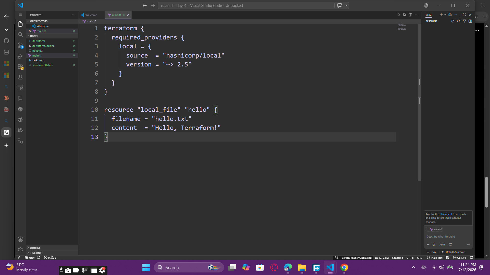
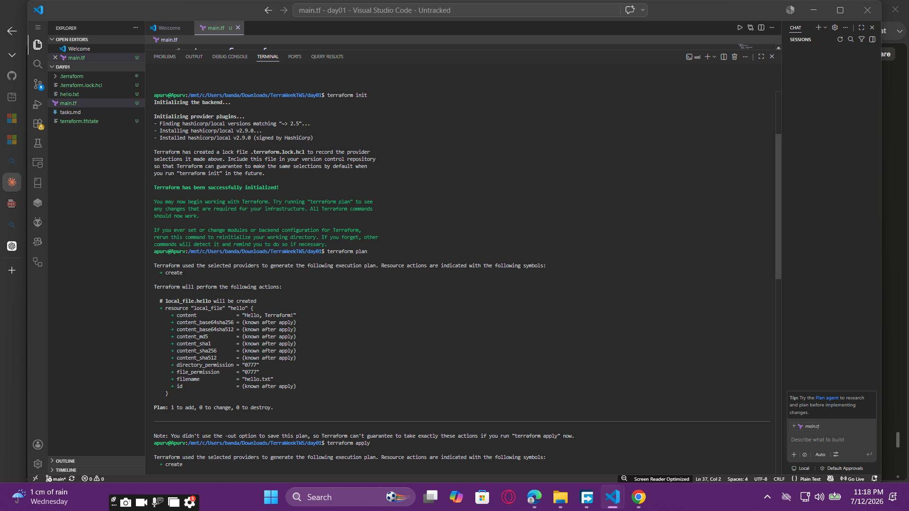

# 🌍 TerraWeek – Day 1: Introduction to Terraform & Terraform Basics

## 📌 Objective

The goal of Day 1 was to understand the fundamentals of **Terraform**, why Infrastructure as Code (IaC) is important, and how Terraform helps automate infrastructure provisioning using code.

---

# 🚀 What is Terraform?

Terraform is an **Infrastructure as Code (IaC)** tool developed by **HashiCorp**. It allows developers and DevOps engineers to define, provision, and manage infrastructure using configuration files instead of manually creating resources.

Terraform supports multiple platforms and services, making infrastructure management simple, consistent, and repeatable.

---

# ❓ Why Do We Need Terraform?

Managing infrastructure manually becomes difficult as projects grow.

Terraform solves this by providing:

* Infrastructure as Code (IaC)
* Automation
* Version Control
* Repeatability
* Consistent Infrastructure
* Easy Scaling
* Reduced Human Errors
* Faster Infrastructure Provisioning

---

# ⚙️ Terraform Installation

## Windows

1. Download Terraform from the official HashiCorp website.
2. Extract the ZIP file.
3. Add the Terraform executable to the system PATH.
4. Verify the installation.

```bash
terraform version
```

---

## Linux (Ubuntu)

```bash
sudo apt update
sudo apt install -y wget unzip

wget https://releases.hashicorp.com/terraform/<VERSION>/terraform_<VERSION>_linux_amd64.zip

unzip terraform_<VERSION>_linux_amd64.zip

sudo mv terraform /usr/local/bin/

terraform version
```

---

# 🧩 Important Terraform Terminologies

## 1. Provider

A Provider is a plugin that allows Terraform to interact with a platform or service.

For this challenge, I used the **Local Provider**.

Example:

```hcl
terraform {
  required_providers {
    local = {
      source  = "hashicorp/local"
      version = "~> 2.5"
    }
  }
}
```

---

## 2. Resource

A Resource is the infrastructure object that Terraform creates and manages.

Example:

```hcl
resource "local_file" "hello" {
  filename = "hello.txt"
  content  = "Hello, Terraform!"
}
```

---

## 3. Variables

Variables make Terraform configurations reusable.

Example:

```hcl
variable "file_name" {
  default = "hello.txt"
}
```

Usage:

```hcl
resource "local_file" "hello" {
  filename = var.file_name
  content  = "Hello, Terraform!"
}
```

---

## 4. Output

Outputs display useful information after Terraform finishes execution.

Example:

```hcl
output "file_name" {
  value = local_file.hello.filename
}
```

---

## 5. State File

Terraform stores infrastructure information in the **terraform.tfstate** file.

Purpose:

* Tracks created resources
* Detects infrastructure changes
* Maintains the current state
* Helps Terraform update resources efficiently

---

# 📝 Basic Terraform Workflow

Initialize Terraform:

```bash
terraform init
```

Preview the execution plan:

```bash
terraform plan
```

Create the resource:

```bash
terraform apply
```

Delete the resource:

```bash
terraform destroy
```

---

# 📂 Sample Terraform Configuration

```hcl
terraform {
  required_providers {
    local = {
      source  = "hashicorp/local"
      version = "~> 2.5"
    }
  }
}

resource "local_file" "hello" {
  filename = "hello.txt"
  content  = "Hello, Terraform!"
}
```

Commands used:

```bash
terraform init
terraform plan
terraform apply
terraform destroy
```

This configuration creates a simple **hello.txt** file on the local machine using Terraform.

---

# 📸 Screenshots

## 📝 Terraform Configuration (`main.tf`)

This screenshot shows the Terraform configuration file used in this challenge.



---

## 💻 Terraform Commands Execution

This screenshot demonstrates the successful execution of Terraform commands.



---

# 🎯 Key Learnings

* Understood the concept of Infrastructure as Code (IaC).
* Learned why Terraform is widely used for infrastructure automation.
* Explored Terraform Providers, Resources, Variables, Outputs, and State Files.
* Learned the Terraform workflow using `terraform init`, `terraform plan`, `terraform apply`, and `terraform destroy`.
* Practiced Terraform on my local machine using the **Local Provider**.
* Successfully created and managed a local resource using Terraform.

---

# 🛠️ Tools Used

* Terraform
* Visual Studio Code
* Git
* GitHub
* Windows Terminal

---

# 🙌 Conclusion

Day 1 provided a strong foundation in Terraform and Infrastructure as Code (IaC). I practiced Terraform on my local machine using the Local Provider, understood the Terraform workflow, and learned how Terraform manages resources through configuration files and the state file. This knowledge will help me provision cloud infrastructure in the upcoming TerraWeek challenges.

---

## 📌 Repository Structure

```text
TerraWeek-Day1/
│── README.md
│── main.tf
│── maintf.png
│── commands.png
```

---

## 👨‍💻 Author

**Apurv Bajpai**

**TerraWeek Challenge – Day 1**
