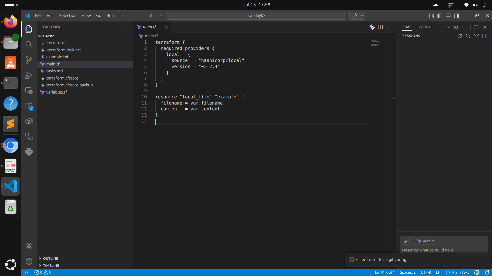

# 🌍 TerraWeek – Day 2: HCL Syntax, Variables & Expressions

## 📌 Objective

The goal of Day 2 was to get comfortable with **HashiCorp Configuration Language (HCL)** — the syntax used to write Terraform configurations — and to understand how **variables, data types, and expressions** make configurations reusable and dynamic.

---

# 🧩 Understanding HCL Syntax

HCL (HashiCorp Configuration Language) is the declarative language Terraform uses to define infrastructure. Every `.tf` file is built from a few core building blocks.

## 1. Blocks

A block is a container for configuration. It has a type, optional labels, and a body enclosed in `{ }`.

```hcl
resource "local_file" "example" {
  filename = "example.txt"
  content  = "Hello, Terraform!"
}
```

Here, `resource` is the block type, `"local_file"` and `"example"` are labels.

## 2. Parameters & Arguments

Inside a block, key-value pairs like `filename = "example.txt"` are called **arguments**. They configure the behavior of that block.

## 3. Resources & Data Sources

* **Resources** — define infrastructure objects Terraform creates and manages (e.g., `local_file`, `aws_instance`, `docker_container`).
* **Data Sources** — allow Terraform to fetch/read information about existing infrastructure without creating or managing it (declared using the `data` block).

```hcl
data "local_file" "existing" {
  filename = "existing.txt"
}
```

---

# 🔤 Variables, Data Types & Expressions

## 1. Variables

Variables make configurations reusable by removing hardcoded values.

**`variables.tf`**

```hcl
variable "filename" {
  description = "The path/name of the file to be created"
  type        = string
  default     = "example.txt"
}

variable "content" {
  description = "The content to write inside the file"
  type        = string
  default     = "Hello, this file was created using Terraform!"
}
```

## 2. Data Types

HCL supports several types for variables:

* `string`
* `number`
* `bool`
* `list`
* `map`
* `set`
* `object`
* `tuple`

## 3. Expressions

Expressions let you reference variables and values elsewhere in your configuration using the `var.<name>` syntax.

**`main.tf`**

```hcl
terraform {
  required_providers {
    local = {
      source  = "hashicorp/local"
      version = "~> 2.4"
    }
  }
}

resource "local_file" "example" {
  filename = var.filename
  content  = var.content
}
```

---

# 📝 Terraform Workflow Used

Initialize Terraform and download the provider:

```bash
terraform init
```

Preview the execution plan:

```bash
terraform plan
```

Apply the configuration:

```bash
terraform apply
```

---

# 🐞 Debugging Note

While running `terraform apply`, I initially pointed the `filename` variable to `/root/example.txt` and hit the following error:

```text
Error: Create local file error
An unexpected error occurred while writing the file
Original Error: open /root/example.txt: permission denied
```

**Cause:** This wasn't a Terraform issue — it was a standard Linux permission issue. `/root` belongs to the root user, and my session was running as a regular user without write access there.

**Fix:** Updated the `filename` variable's default value to a path inside my own project directory instead:

```hcl
variable "filename" {
  default = "example.txt"
}
```

**Key takeaway:** `terraform plan` can show a perfectly clean plan even if the `apply` step is destined to fail — Terraform doesn't validate OS-level permissions during planning, only at apply time.

---

# 📂 Sample Terraform Configuration

**`variables.tf`**

```hcl
variable "filename" {
  description = "The path/name of the file to be created"
  type        = string
  default     = "example.txt"
}

variable "content" {
  description = "The content to write inside the file"
  type        = string
  default     = "Hello, this file was created using Terraform!"
}
```

**`main.tf`**

```hcl
terraform {
  required_providers {
    local = {
      source  = "hashicorp/local"
      version = "~> 2.4"
    }
  }
}

resource "local_file" "example" {
  filename = var.filename
  content  = var.content
}
```

Commands used:

```bash
terraform init
terraform plan
terraform apply
```

This configuration creates an **example.txt** file locally, with its name and content driven entirely by variables.

---

# 📸 Screenshots

## 📝 Terraform Configuration (`variables.tf` & `main.tf`)

This screenshot shows the variable declarations and the resource block referencing them.



---

## 💻 Terraform Commands Execution

This screenshot demonstrates the `init`, `plan`, and `apply` workflow, including the permission error and its resolution.


---

# 🎯 Key Learnings

* Understood HCL syntax — blocks, parameters, and arguments.
* Explored the difference between resources and data sources in Terraform.
* Learned how to declare variables with `type`, `description`, and `default` in a `variables.tf` file.
* Used expressions (`var.<name>`) to reference variables inside a `main.tf` resource block.
* Practiced overriding variable values using `-var` flags and `terraform.tfvars`.
* Debugged a real-world file permission error and learned that Terraform's `plan` doesn't validate OS-level permissions.

---

# 🛠️ Tools Used

* Terraform
* Visual Studio Code
* Git
* GitHub
* Linux Terminal

---

# 🙌 Conclusion

Day 2 built directly on the fundamentals from Day 1 by diving into HCL syntax and making configurations dynamic through variables and expressions. I practiced defining variables in a separate `variables.tf` file, referencing them in `main.tf`, and troubleshooting a real permissions error along the way. This sets up a solid foundation for Day 3, where I'll add `required_providers` for Docker/AWS and test the configuration end-to-end.

---

## 📌 Repository Structure

```text
TerraWeek-Day2/
│── README.md
│── variables.tf
│── main.tf
│── maintf.png
│── commands.png
```

---

## 👨‍💻 Author

**Your Name**

**TerraWeek Challenge – Day 2**
