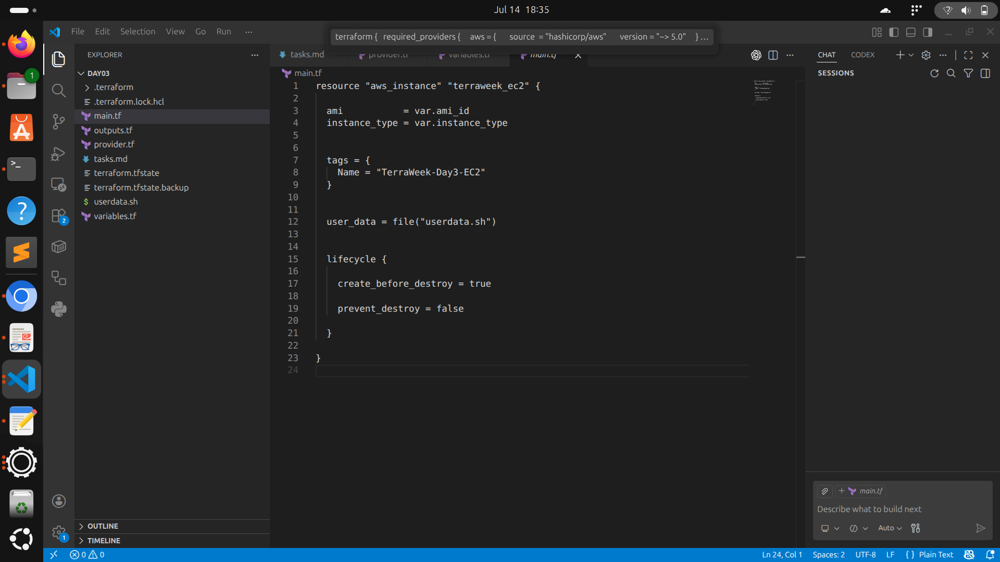
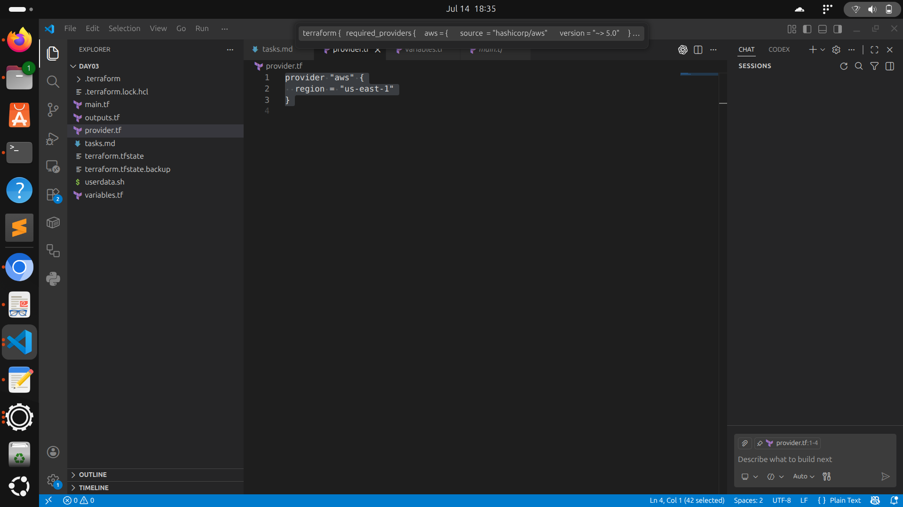
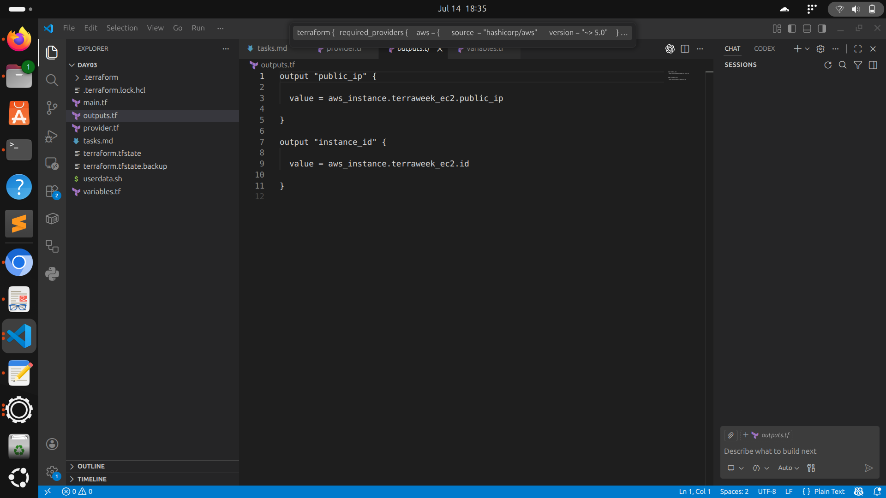
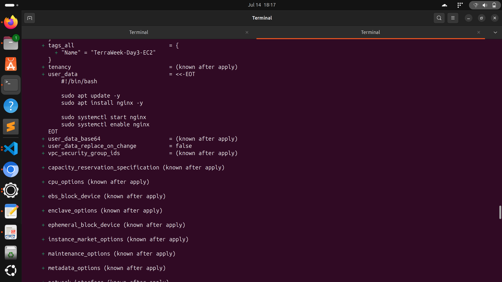
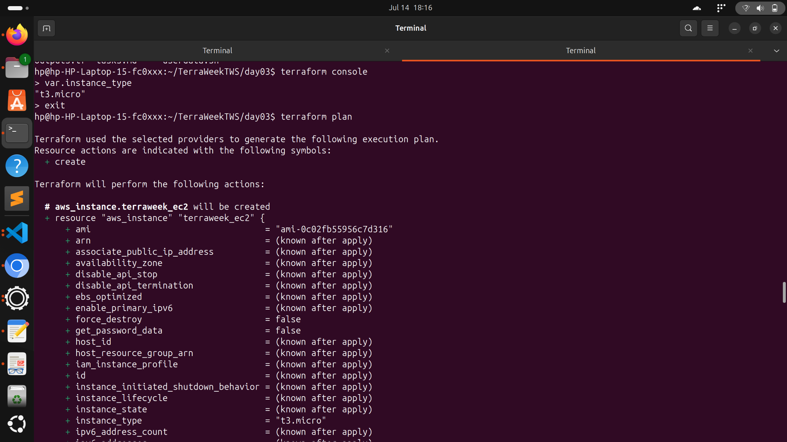
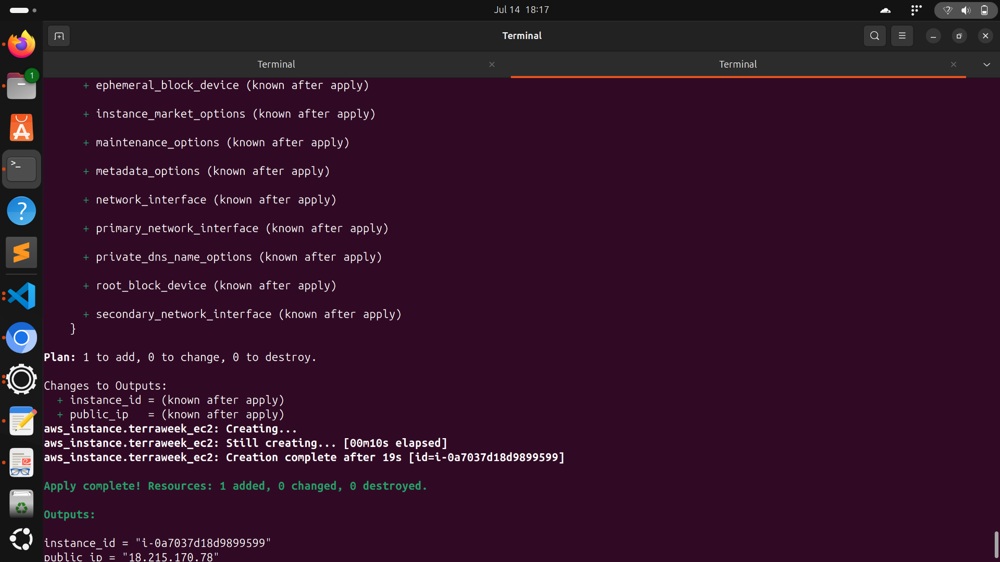
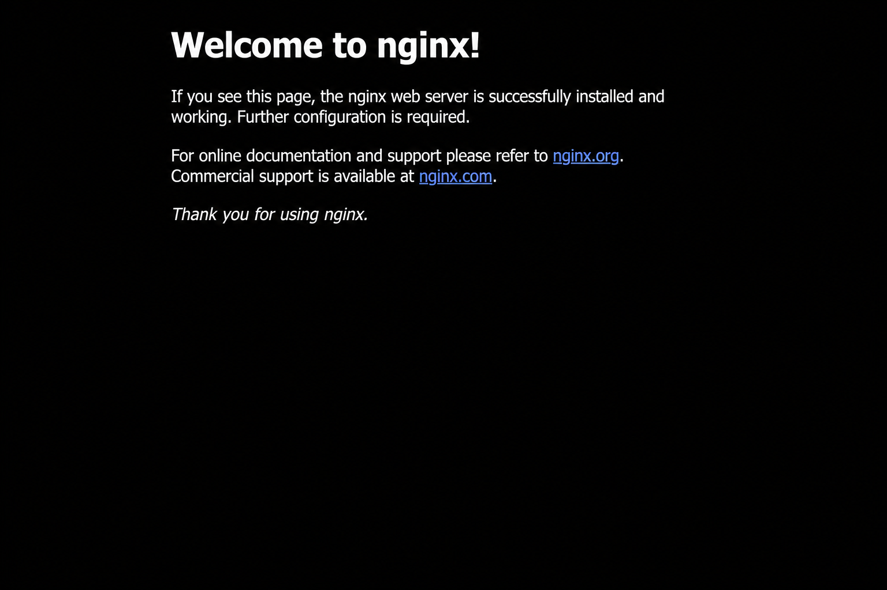

# 🚀 TerraWeek Day 3 – AWS EC2 Provisioning with Terraform

> Provisioned an AWS EC2 instance using **Terraform**, configured it automatically with **Nginx** using **user_data**, explored **Terraform State**, **Provisioners**, and **Lifecycle Management**.


---

# 📌 About

This project was completed as part of **TerraWeek Day 3**.

The objective was to learn how Terraform provisions cloud infrastructure and manages its lifecycle.

## Tasks Completed

- ✅ Created an AWS EC2 Instance using Terraform
- ✅ Validated Terraform configuration
- ✅ Generated an execution plan
- ✅ Applied Terraform configuration
- ✅ Explored Terraform State
- ✅ Configured EC2 automatically using `user_data`
- ✅ Learned Terraform Lifecycle Management
- ✅ Destroyed infrastructure using Terraform

---

# 🏗️ Architecture

```
Local Machine
      │
      ▼
Terraform CLI
      │
      ▼
AWS Provider
      │
      ▼
Amazon EC2
      │
      ▼
User Data Script
      │
      ▼
Nginx Installed Automatically
```

---

# 📂 Project Structure

```
day03/

├── provider.tf
├── main.tf
├── variables.tf
├── outputs.tf
├── userdata.sh

├── cmd1.png
├── cmd2.png
├── cmd3.png

├── maintf.png
├── providerstf.png
├── outputstf.png

├── welcome.png
├── Screenshot from 2026-07-14 18-11-23.png

└── README.md
```

---

# ⚙️ Terraform Configuration

## provider.tf

Configures the AWS provider and region.

---

## variables.tf

Contains reusable variables like:

- AMI ID
- Instance Type

---

## main.tf

Creates the EC2 instance with:

- AWS EC2 Resource
- User Data Script
- Lifecycle Rules
- Tags

---

## userdata.sh

Automatically performs:

- Update packages
- Install Nginx
- Start Nginx
- Enable Nginx Service

---

## outputs.tf

Displays:

- EC2 Instance ID
- Public IP Address

---

# 📸 Screenshots

## Terraform Configuration

### main.tf



---

### provider.tf



---

### outputs.tf



---

# 💻 Terraform Commands

## Terraform Init



---

## Terraform Plan



---

## Terraform Apply



---

# ☁️ AWS EC2 Instance

EC2 instance successfully created on AWS.


---

# 🌐 Nginx Welcome Page

The EC2 instance automatically installs Nginx during provisioning using **user_data**.



---

# 🚀 Getting Started

## Clone Repository

```bash
git clone https://github.com/Apurvbajpai2531/TerraWeekTWS.git

cd TerraWeekTWS/day03
```

---

## Initialize Terraform

```bash
terraform init
```

---

## Validate Configuration

```bash
terraform validate
```

---

## Review Execution Plan

```bash
terraform plan
```

---

## Create Infrastructure

```bash
terraform apply -auto-approve
```

---

## View Outputs

```bash
terraform output
```

---

## Destroy Infrastructure

```bash
terraform destroy -auto-approve
```

---

# 📖 Terraform Workflow

```
Write Code
     │
     ▼
terraform init
     │
     ▼
terraform validate
     │
     ▼
terraform plan
     │
     ▼
terraform apply
     │
     ▼
terraform output
     │
     ▼
terraform destroy
```

---

# 📚 Key Learnings

- Infrastructure as Code (IaC)
- AWS EC2 provisioning using Terraform
- Terraform Provider Configuration
- Variables and Outputs
- Terraform State Management
- Terraform Plan & Apply Workflow
- User Data for EC2 Bootstrapping
- Lifecycle Meta Arguments
- Infrastructure Cleanup with Terraform Destroy

---

# 🛠️ Tech Stack

| Technology | Purpose |
|------------|---------|
| Terraform | Infrastructure as Code |
| AWS EC2 | Virtual Machine |
| AWS CLI | AWS Authentication |
| Ubuntu | Development Environment |
| Bash | EC2 Bootstrap Script |
| Git & GitHub | Version Control |

---

# 🙏 Acknowledgements

Special thanks to **Shubham Londhe (TrainWithShubham)** for organizing TerraWeek and providing hands-on DevOps learning opportunities.

Also thanks to the TerraWeek community for continuous support and learning.

---

# ⭐ If you found this project useful

Give this repository a ⭐ and connect with me on LinkedIn for more DevOps and Cloud projects.